> [!IMPORTANT]
> Support an open Android ecosystem: [keepandroidopen.org](https://keepandroidopen.org/) ·
> [Change.org — Stop Google from limiting APK file usage](https://www.change.org/p/stop-google-from-limiting-apk-file-usage)

# BikeTrackd

[](https://feitonobrasil.dev.br)

A cycling speedometer and GPS tracker for Android. Built with Jetpack Compose + Material 3, MapLibre GL maps, and Room database.

[](https://github.com/higorslva/biketrackd/releases/latest/download/app-fdroid-release.apk)

## Features

- **Speedometer** — real-time speed with animated counter and color-coded indicator (green → orange → red)
- **GPS Map** — MapLibre GL map with trail tracking, follow mode, rotation (GPS + gestures), and offline tile download
- **Navigation** — long-press any spot for an A→B route via GraphHopper, with auto-reroute while riding
- **Session Recording** — start/stop sessions with distance, max/avg speed, duration; data persisted with Room
- **GPX Export** — export any recorded session via share sheet
- **Statistics** — records, monthly breakdown, and charts for your riding history
- **Weather** — current temperature display via Open-Meteo API
- **Offline Maps** — download tiles by city (search via Nominatim) or around your position (zoom 10–15, 40 km radius) via MapLibre OfflineManager
- **Bikes & Maintenance** — track bikes and parts with wear percentage and maintenance warnings
- **Battery Status** — built-in battery level indicator
- **Unit System** — metric/imperial toggle with live conversion (km/h ↔ mph, m ↔ ft, °C ↔ °F)
- **Orientation** — automatic, portrait, or landscape with optimized layouts
- **Theme** — system, light, or dark (Material 3, green accent)
- **Font Size** — adjustable UI text scale (0.7×–1.5×)
- **Language** — system, Portuguese, or English
- **Burn-in Protection** — dimming options for bike dashboard use
- **Backup & Restore** — export/import all data as a JSON file

## Tech Stack

| Layer | Library |
|-------|---------|
| UI | Jetpack Compose + Material 3 |
| Map | MapLibre GL (OpenFreeMap vector tiles) |
| Persistence | Room (SQLite) |
| Weather | Open-Meteo API |
| Routing | GraphHopper API (A→B navigation) |
| Geocoding | OpenStreetMap Nominatim |
| Location | Android LocationManager (GPS_PROVIDER) |
| Icons | Material Icons Extended |

## Screens

- **GPS** — interactive map with trail overlay, follow/center button, rotation, offline download, and A→B navigation
- **DASHBOARD (PAINEL)** — speedometer with GPS status, weather, battery, clock; dashboard warnings (BAT, ENG, GPS, TMP, MR) and session stats
- **BIKES** — manage bikes and parts with wear tracking
- **MAINT. (MANUT.)** — parts list with wear alerts and maintenance suggestions
- **STATS (ESTAT)** — session history with GPX export, records, and monthly stats
- **SETTINGS (OPÇÕES)** — unit system, orientation, theme, font size, language, bike lane speed limit, burn-in protection, offline map management (list, delete, download by city), GraphHopper API key, and backup/restore
- **ABOUT (SOBRE)** — app info and license

## Screenshots

### Map & Navigation

| Route map (landscape) | Route + Speedometer (landscape) |
|---|---|
| 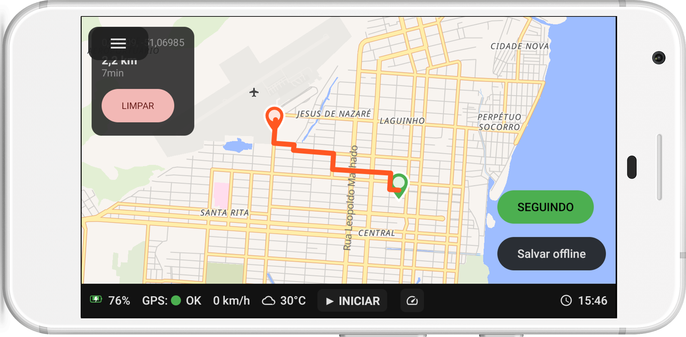 | 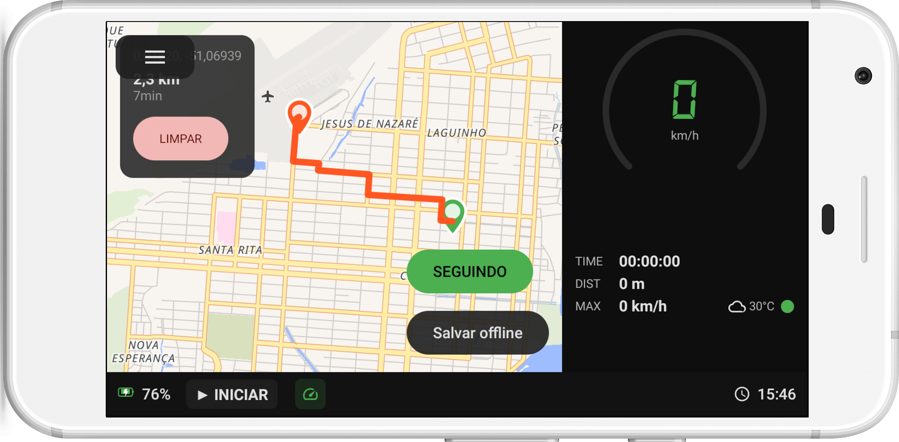 |

| Map + Mini speedometer (portrait) | Map + Mini speedometer (landscape) |
|---|---|
| 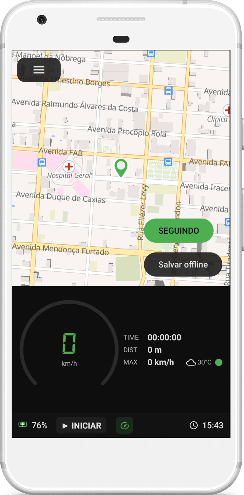 | 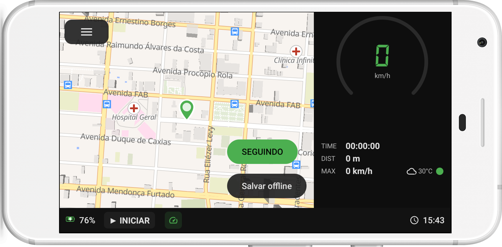 |

### Speedometer

| Portrait | Landscape | MR Warning |
|---|---|---|
| 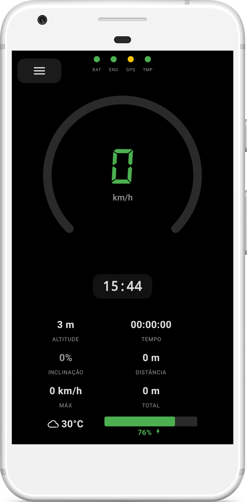 | 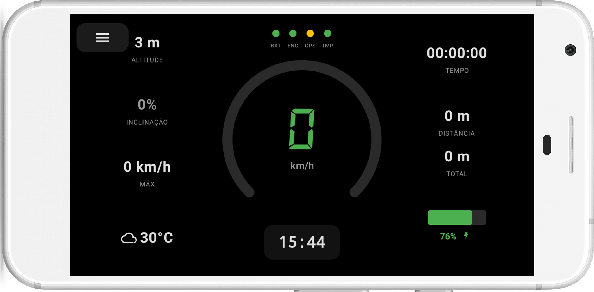 | 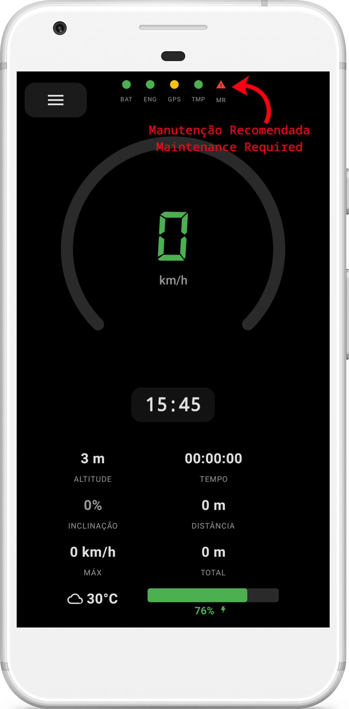 |

### Bikes & Parts

| Edit bike | Parts list | Add part |
|---|---|---|
| 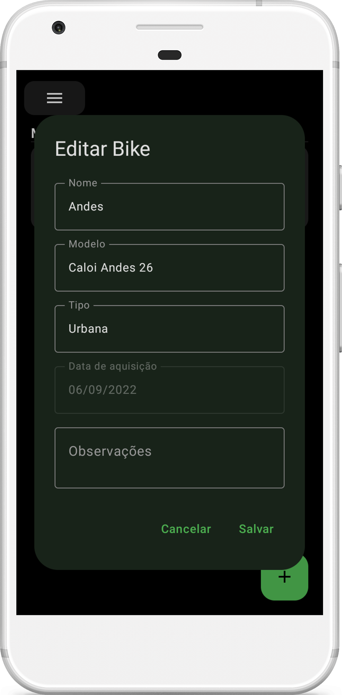 | 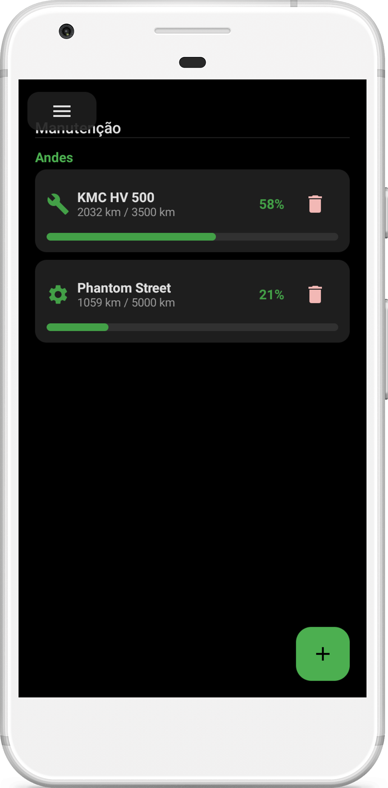 | 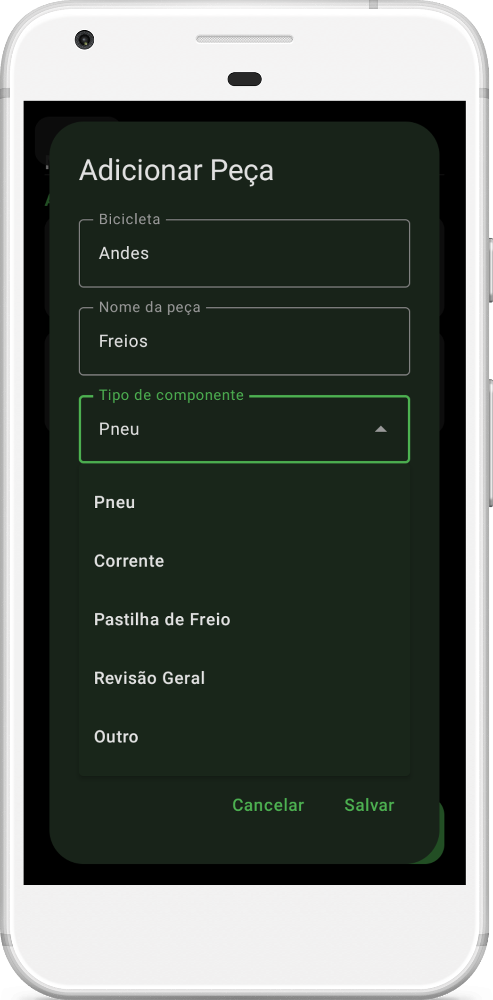 |

| Edit part | Wear alert |
|---|---|
| 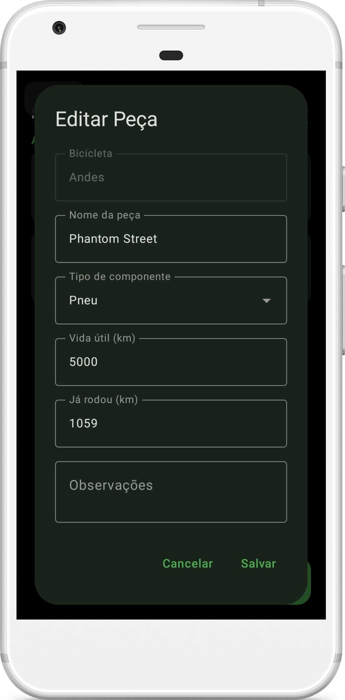 | 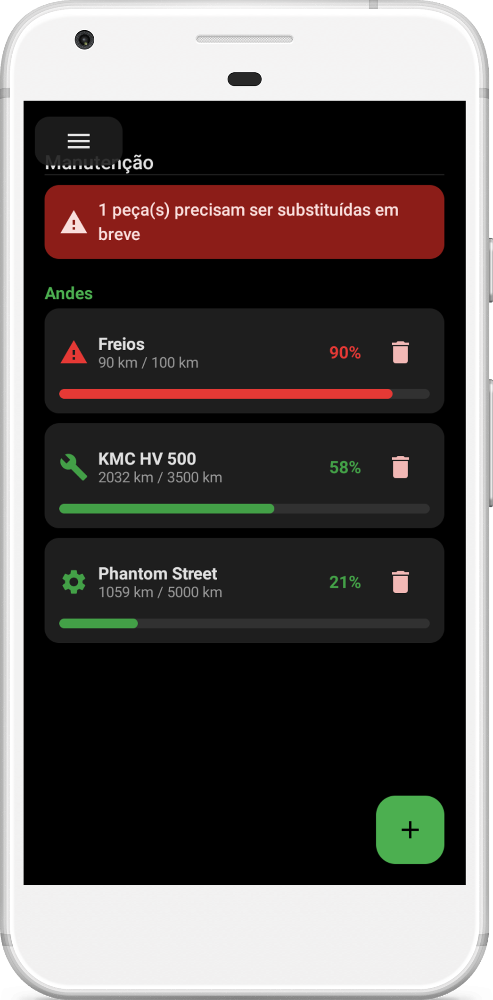 |

### Settings

| Settings |
|---|
| 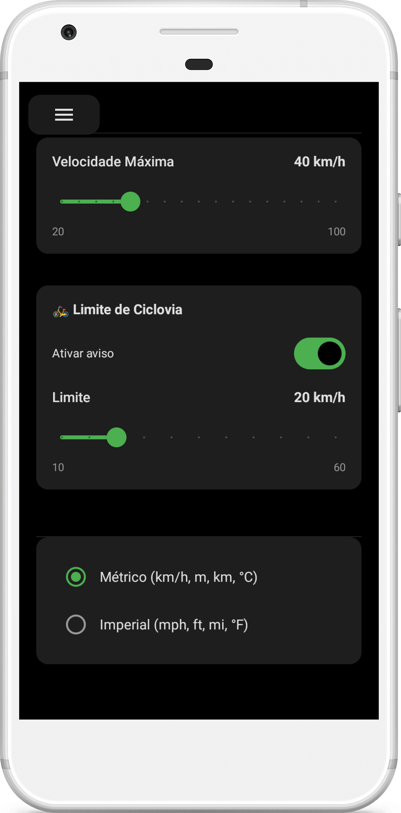 |

## Dashboard Warnings

| Indicator | Color | Meaning |
|-----------|-------|---------|
| **BAT** | Green / Amber / Red | Battery ≥40% / 16–40% / ≤15% (blinking + warning icon) |
| **ENG** | Green / Amber | Session active / Moving without an active session |
| **GPS** | Green / Yellow / Red | Position fix acquired / Stationary (<3 km/h) / No fix (blinking) |
| **TMP** | Green / Amber / Red | Normal / Warm / Moderate, hot or critical (blinking + warning icon) |
| **MR** | Red blinking | Maintenance Required — any part has reached ≥90% wear |
| **⚠ BIKE LANE** | Red banner | Speed exceeds the configured bike lane limit |

## Architecture

```
com.biketrackd.app
├── data/           Room entities, DAOs, DB, GPX exporter, offline tile manager, GraphHopper client, preferences, backup
├── location/       LocationService, LocationRepository (singleton state + trail), thermal manager
├── ui/
│   ├── components/ Sidebar, StatusBar, MiniSpeedometer, charts, dialogs
│   ├── screens/    Gps, Speedometer, Bikes, Maintenance, Stats, Settings, About
│   └── theme/      Color, Type, Theme (Material 3, green #4CAF50)
└── weather/        Open-Meteo client, weather data
```

The data, location, and weather layers are fully decoupled from the UI — the same architecture can be reused with a different frontend.

## Build

```
./gradlew assembleDebug
```

Requires Android SDK 34, Kotlin 1.9.22, Compose BOM 2024.06.00.

## License

MIT
